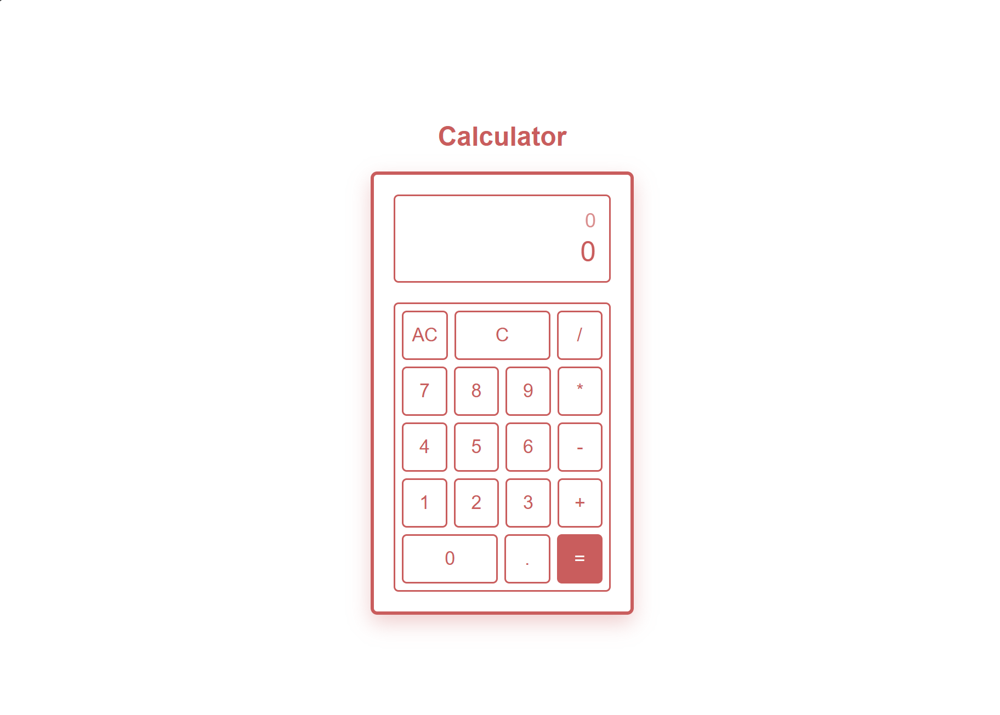

# Modern Calculator

**Calculator** is a fully functional, sleek web calculator built as part of The Odin Project curriculum. It features advanced expression tracking, decimal control, keyboard support, and a clean, responsive layout that adapts seamlessly from desktop to mobile screens.

<a href="https://cmatsagka.github.io/calculator/" style="color: inherit; text-decoration: underline; font-weight: 600;">🌐 View Live Demo</a>



---

## 🌟 Key Features

- **Real-time Expression Display:** Tracks your active calculation string alongside live intermediate results.
- **Keyboard Support:** Full capability to type numbers, use operators, hit `Enter` for equals, `Backspace` for clearing individual entries, and `Escape` to clear all (`AC`).
- **Error Prevention & Handling:** Gracefully handles edge cases like multiple decimal inputs and division by zero.
- **Precision Control:** Automatically rounds numbers exceeding 6 decimal places for clean, readable displays.
- **Responsive Layout:** Uses CSS Container Queries and media queries to look immaculate on both large monitors and mobile devices.

---

## 🛠️ Tech Stack & Architecture

- **Markup:** Semantic HTML5 structure.
- **Styling:** Modern CSS3 featuring Flexbox, custom container queries (`container-type: inline-size`), and smooth transitions.
- **Logic:** Vanilla JavaScript (ES6) driving a custom-built calculation engine with comprehensive event listeners for both mouse clicks and keyboard strokes.

---

## 🚀 Quick Start

Clone the repository:

```bash
git clone git@github.com:cmatsagka/calculator.git
```

Open the project directory:

```bash
cd calculator
```

## 📂 Project Structure

```text
calculator/
├── index.html       # Main calculator interface and display markup
├── styles.css       # Complete design system and responsive media queries
├── script.js        # Core calculator arithmetic engine and event listeners
```
